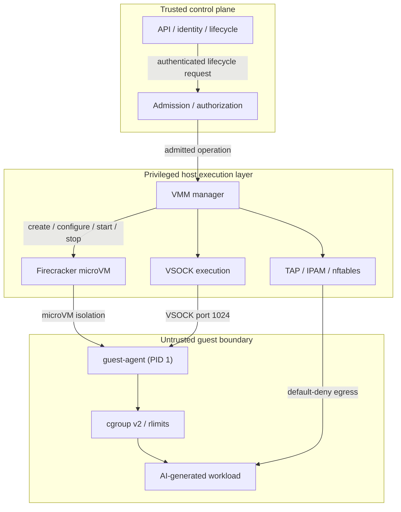
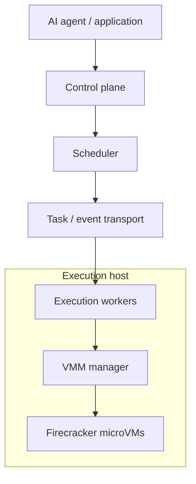
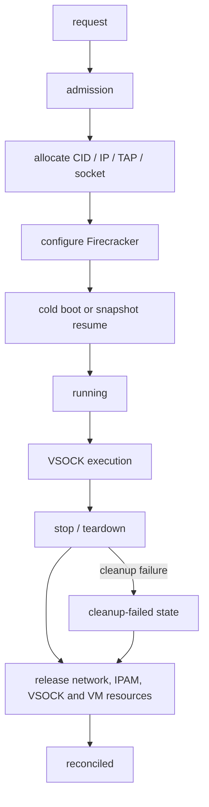

# Architecture

Shiyao (石爻) is a self-hosted execution platform for running untrusted AI agent code in isolated Firecracker microVMs.

## Architecture at a glance

The architecture has four trust-relevant layers:



The **control plane** decides what may run and which resources may be consumed. The **privileged execution layer** owns Firecracker and host resources. The **guest** is the security boundary for untrusted agent code.

The diagram is intentionally explicit about trust: a component being part of Shiyao does not make it trusted with workload state.

## Current implementation

The current repository is the source of truth for the implementation boundary. Today, Shiyao provides the core execution primitives on a host:

- A VMM manager for Firecracker VM lifecycle and admission control.
- Per-VM TAP/IPAM resources with shared nftables policy.
- VSOCK-based guest execution with bounded requests, output, timeouts, and concurrency.
- A guest agent with cgroup v2 and `rlimit` enforcement where the host/guest environment supports it.
- Snapshot resume and warm-instance pooling.
- Cleanup/reconciliation for VM-owned host resources.

The current control plane should therefore be understood as the services and packages that exist in this repository, not as a promise of a fully distributed scheduler or control service.

## Future architecture

Shiyao is designed so the privileged execution layer can later be distributed across multiple hosts. That future architecture may introduce explicit scheduling and worker boundaries:



These distributed components are **future architecture, not current implementation claims**. An external event bus, horizontally scaled worker fleet, durable scheduler state, and multi-host placement should not be inferred from the conceptual separation above.

## Components

### VMM manager

The VMM manager owns the lifecycle of Firecracker instances and coordinates the resources required by each VM.

Its responsibilities include:

- VM creation, start, stop, and deletion.
- Admission control and backpressure.
- VSOCK CID allocation.
- Guest subnet/IPAM allocation.
- TAP device lifecycle.
- Network-policy setup and cleanup.
- Snapshot resume.
- Warm-instance pooling.
- Coordinated cleanup and reconciliation when lifecycle operations fail.

The manager keeps live instance state in memory and coordinates resource ownership across the VMM, network, IPAM, and VSOCK subsystems.

### Firecracker

Firecracker provides the microVM isolation boundary. Shiyao configures each VM with a kernel, read-only root filesystem, vCPU and memory resources, networking, and a VSOCK device.

Shiyao supports both normal VM boot and snapshot resume. Snapshot support is intended to reduce startup work for prepared environments; actual latency depends on the host and guest configuration.

### Network and IPAM

Each VM receives its own TAP interface and guest network allocation.

```text
VM
 │
 │ VirtIO network
 ▼
TAP device
 │
 ▼
nftables policy
 │
 ▼
host network
```

Guest forwarding is default-deny. Shiyao maintains shared nftables policy using sets rather than creating an independent firewall chain for every VM.

The policy includes established/related connections, guest DNS to the configured host gateway, configured proxy/host-gateway access, explicit outbound TCP destinations/ports, blocking `169.254.169.254`, and dropping other traffic originating from managed guest TAP interfaces.

### VSOCK execution boundary

The host communicates with the guest agent through Firecracker VSOCK rather than exposing an SSH or guest-network execution service.

The guest agent listens on VSOCK port `1024` and accepts a bounded execution protocol. Host-side execution also validates the lifecycle identity of the VM before treating a guest response as belonging to the requested instance.

Current protocol limits include:

- Maximum request size: **1 MiB**.
- Maximum concurrent executions per guest: **4**.
- Maximum captured stdout: **10 MiB**.
- Maximum captured stderr: **10 MiB**.
- Maximum streaming frame: **64 KiB**.
- Bounded command execution timeout.

### Guest agent

The guest agent is a small Go binary that runs inside the microVM and provides the execution endpoint.

It is responsible for receiving and validating execution requests, authenticating the host VSOCK peer by CID, executing commands, applying guest-side resource controls, returning bounded output, and managing the guest's ephemeral execution environment.

Guest-side resource controls use Linux cgroup v2 and `rlimit` mechanisms where the host/guest environment provides the required capabilities.

## VM lifecycle



Admission control happens before expensive provisioning work. If capacity is exhausted, callers receive backpressure instead of creating an unbounded number of VMs.

Cleanup is part of lifecycle correctness rather than optional best-effort work: TAP devices, nftables state, IPAM allocations, VSOCK allocations, sockets, and Firecracker resources must all be accounted for when a VM is removed.

## Warm instances

Shiyao can keep prepared VMs in a warm pool to avoid repeated provisioning work.

A warm instance is leased to a caller and is only returned to the idle pool after the supplied reset operation succeeds and the instance remains runnable. If reset fails or the instance is no longer running, it is evicted and stopped instead of being returned to the pool.

The reset procedure is therefore part of the reuse security boundary and must establish the intended clean state before another workload can receive the VM.

## Snapshots

Snapshots provide another fast-start path. A prepared VM can be resumed rather than performing a complete cold boot and guest initialization sequence.

Shiyao includes benchmark support for comparing cold boot and snapshot-resume durations. These measurements should use the same guest image and readiness criteria and should be run as privileged integration benchmarks on the target host configuration.

## Security-boundary matrix

| Boundary | Mechanism | Primary threats addressed | Trust assumption / residual risk |
| --- | --- | --- | --- |
| Control plane → VMM | Authenticated lifecycle calls, admission limits | Unauthorized lifecycle actions, host exhaustion | Control-plane identity and authorization remain trusted |
| Host → guest | Firecracker microVM + VSOCK | Guest access to host processes/files | Kernel, KVM, Firecracker and host configuration are correct |
| Guest → host execution API | VSOCK + peer-CID authentication + bounded protocol | Impersonation, malformed requests, oversized output | VSOCK implementation and VM identity mapping are correct |
| Guest → network | Per-VM TAP + shared nftables default-deny | Unauthorized egress, metadata access | Host routing/firewall state and policy updates are correct |
| Workload → workload | One workload per microVM | Cross-workload filesystem/process access | Firecracker isolation boundary remains intact |
| Workload → resources | vCPU/memory envelope + cgroup v2 + rlimits + admission | CPU, memory, PID, file and concurrency exhaustion | Host/guest kernel capabilities support enforcement |
| Warm VM reuse | Reset contract + failed-reset eviction | Cross-tenant state leakage | Reset procedure actually destroys prior workload state |
| Snapshot reuse | Prepared snapshot + integrity validation | Boot-time tampering or mismatched snapshot assets | Snapshot artifacts and target host remain trusted |
| VM teardown | Coordinated cleanup + reconciliation | Leaked TAP/firewall/IPAM/socket resources | Reconciliation eventually obtains required host privileges |

## Trust assumptions

1. **Guest code is hostile.** Code generated, downloaded, or modified by an agent must be treated as untrusted even when the agent is authorized to run it.
2. **The host is the root of trust.** The Linux kernel, KVM, Firecracker binary, host filesystem containing VM artifacts, nftables configuration, and VMM process are privileged components.
3. **The control plane is trusted to make policy decisions.** Authentication and authorization failures at the control-plane boundary can lead to unauthorized workload execution even if the microVM boundary remains intact.
4. **VM identity must remain bound to lifecycle state.** A VSOCK response is only meaningful when it can be associated with the VM instance that the control plane admitted.
5. **Resource limits are defense-in-depth.** cgroup and `rlimit` enforcement reduce blast radius but do not replace microVM isolation or host-level capacity controls.
6. **Network policy is explicit, not omniscient.** Default-deny limits exposure, but correctness still depends on the deployed nftables, routing, proxy, and DNS configuration.
7. **Warm-pool reset is a security operation.** A reset that only makes a VM look healthy is insufficient unless it also establishes the intended clean-state guarantee.
8. **Snapshots are trusted artifacts.** Snapshot memory/state files, kernel, and root filesystem must be controlled and validated for the deployment in which they are used.
9. **Production security is environment-specific.** Security claims must be validated against the exact Linux kernel, KVM, Firecracker, nftables, cgroup, guest image, and guest-agent configuration used in deployment.

## Current vs. future

| Area | Current implementation | Future direction |
| --- | --- | --- |
| Control plane | Repository services/packages for API, identity, lifecycle and authorization | Horizontally scalable control plane |
| Scheduling | Admission and local provisioning coordination | Multi-host scheduler / placement |
| Execution | Local VMM manager and Firecracker instances | Worker fleet across execution hosts |
| Messaging | No distributed execution guarantee is implied by the current repository | Durable task/event transport |
| Persistence | Current repository state/persistence components | Durable lifecycle/reconciliation state across hosts |
| Networking | Host-local TAP/IPAM/nftables policy | Host-specific network agents/policy reconciliation |

Only the current-implementation column should be used when describing what Shiyao currently guarantees.

## Design principles

1. **Treat agent code as untrusted.** Isolation starts at the VM boundary.
2. **Keep execution bounded.** Requests, concurrency, output, lifetime, and resources should have explicit limits.
3. **Make network access explicit.** Default-deny is preferable to trying to enumerate everything a workload must not reach.
4. **Make resource ownership explicit.** Every VM should have a clear owner for its IP, TAP device, VSOCK CID, socket, and Firecracker process.
5. **Prefer disposable state.** Workload state should not become durable merely because a VM is reused.
6. **Optimize without weakening isolation.** Warm pools and snapshots exist to reduce startup cost while preserving the VM boundary.
7. **Design for failure.** Provisioning and teardown can fail independently; cleanup and reconciliation are part of the architecture.
8. **Document trust boundaries explicitly.** Diagrams should distinguish trusted, privileged, untrusted, and future components rather than relying on naming alone.
